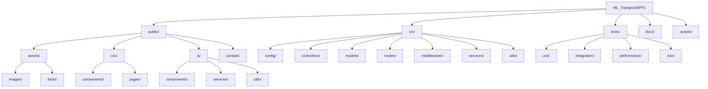

# Application ML Transport

Application de gestion complète pour l'entreprise ML Transport, offrant des fonctionnalités de suivi des véhicules, gestion des chauffeurs, maintenance, facturation et rapports.

## 🚀 Fonctionnalités

- **Gestion de flotte** : Suivi des véhicules et de leur état
- **Gestion des chauffeurs** : Suivi des conducteurs et de leurs affectations
- **Maintenance** : Planification et suivi des opérations de maintenance
- **Facturation** : Gestion des factures et des paiements
- **Rapports** : Génération de rapports et tableaux de bord
- **Synchronisation** : Fonctionnement hors ligne avec synchronisation automatique

## 🏗 Structure du Projet



### Détails de la Structure

```text
ML_TransportAPP1/
├── public/                  # Fichiers statiques servis au client
│   ├── assets/             # Ressources statiques
│   │   ├── images/         # Images de l'application
│   │   └── fonts/          # Polices personnalisées
│   ├── css/                # Feuilles de style
│   │   ├── components/     # Styles des composants réutilisables
│   │   └── pages/          # Styles spécifiques aux pages
│   └── js/                 # Code JavaScript côté client
│       ├── components/     # Composants UI réutilisables
│       ├── services/       # Services pour les appels API
│       └── utils/          # Utilitaires et helpers
│   └── partials/           # Partiels HTML réutilisables
│
├── src/                    # Code source du backend
│   ├── config/            # Fichiers de configuration
│   ├── controllers/       # Contrôleurs pour les routes
│   ├── models/            # Modèles de données
│   ├── routes/            # Définitions des routes
│   ├── middlewares/       # Middlewares personnalisés
│   ├── services/          # Logique métier
│   └── utils/             # Utilitaires et helpers
│
├── tests/                 # Tests automatisés
│   ├── unit/             # Tests unitaires
│   ├── integration/      # Tests d'intégration
│   ├── performance/      # Tests de performance
│   └── e2e/              # Tests end-to-end
│
├── docs/                  # Documentation du projet
├── scripts/              # Scripts utilitaires
└── .vscode/              # Configuration VSCode
```

## Installation

### Prérequis

- [Node.js](https://nodejs.org/) (version 14 ou supérieure)
- npm (version 6 ou supérieure)
- Navigateur web moderne (Chrome, Firefox, Edge, Safari)

### Étapes d'Installation

1. **Cloner le dépôt** :

   ```bash
   git clone https://github.com/votre-utilisateur/ml-transport-app.git
   cd ml-transport-app
   ```

2. **Installer les dépendances** :

   ```bash
   npm install
   ```

3. **Configurer l'environnement** :
   - Copier `.env.example` vers `.env`
   - Modifier les variables d'environnement selon vos besoins

   ```bash
   npm start
   ```
   L'application sera accessible à l'adresse : `http://localhost:3000`

## 🚀 Démarrage rapide

1. **Mode développement** :
   ```bash
   npm run dev
   ```
   Démarre le serveur avec le rechargement automatique.

2. **Production** :
   ```bash
   npm run build
   npm start
   ```
   Construit et démarre l'application pour la production.

3. **Linting** :
   ```bash
   npm run lint        # Vérifier le code
   npm run lint:fix    # Corriger automatiquement les problèmes
   ```

4. **Formatage** :
   ```bash
   npm run format      # Formater le code avec Prettier
   ```

## 📦 Dépendances principales

- **Frontend** :
  - Bootstrap 5.3
  - Chart.js pour les graphiques
  - Flatpickr pour les sélecteurs de date
  - Moment.js pour la manipulation des dates

- **Backend** :
  - Express.js
  - Node-localstorage pour le stockage local
  - Helmet pour la sécurité

## 🤝 Contribution

1. Créer une branche pour votre fonctionnalité :
   ```bash
   git checkout -b feature/nouvelle-fonctionnalite
   ```

2. Faire un commit de vos changements :
   ```bash
   git commit -m "feat: ajouter une nouvelle fonctionnalité"
   ```

3. Pousser les changements :
   ```bash
   git push origin feature/nouvelle-fonctionnalite
   ```

4. Créer une Pull Request

## 📄 Licence

1. Ce projet est sous licence propriétaire. Tous droits réservés © ML_Forever.Inc

## 📞 Contact

Pour toute question ou support, veuillez contacter :
- Email : mltransport1174@gmail.com
- arleys4u@gmail.com
- Téléphone : +241 077971697

1. Construire l'application :
   ```bash
   npm run build
   ```
2. Déployer le contenu du dossier `public/` sur votre serveur web

## Licence

Propriétaire - ML_Forever.Inc and CO
